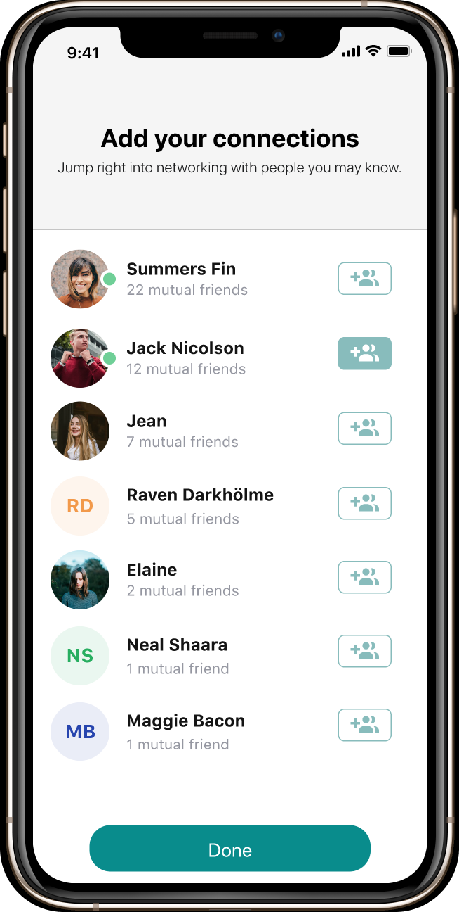

## Introduction
This prototype was a side project to explore ways real estate investors can connect with each other and grow their portfolios more efficiently. The idea came to mind as I was managing some out of state properties from across the country, in a different time zone. Although I had a community of friends and family in the area, there were times I wished I had a more experienced local investor, equally as passionate about real estate to act as my boots on the ground in certain situations. 

I am able to network with investors online using facebook groups and forums such as BiggerPockets, but what if there was a more intelligent, streamlined way to connect with like-minded individuals? Less work, more effective and automated. Dating apps are already utilizing similar algorithms, why not in a niche industry like real estate? 

#### Onboarding
By employing value-oriented onboarding, the higher level benefits of Coraway are highlighted, communicating the key value elements of the app, accompanied by fun colors and imagery.
<Row>
<Col>

</Col>
<Col>

</Col>
<Col>

</Col>
<Col>

</Col>

</Row>

#### Choose your Interests
Next, onto the important customization element, here the user has a chance to tell Coraway their particular interests so that it can provide them with the best recommendations.
<Row>
<Col>

</Col>
<Col>

</Col>
<Col>

</Col>
</Row>

#### Invite your friends!
<Row>

<Col>

</Col>

<Col>

</Col>
<Col>

</Col>

</Row>

#### Explore Topics & Activity in your Network
Users can enjoy browsing topics that were automatically generated based on their interests. They can also browse trending topics from others in the real estate community. 
Users can: 

- Share updates on their real estate journey
- Create a portfolio to showcase their current and previous reale state investments
- Follow, like, and share posts to other social media channels

<Row>

<Col>

</Col>

<Col>

</Col>

<Col>

</Col>
<Col>

</Col>

</Row>

#### Proactive Networking
Schedule time with potential investment partners, property managers, agents, or other real estate professionals.
<Row>
<Col>

</Col>
<Col>

</Col>

<Col>

</Col>
</Row>

#### Chat and Engage the Community  
Whether your an out of state investor looking to connect with local investors where your investments are located, or an agent looking to make better connections and grow your business, anyone can utilize Coraway to increase personal connections within their real estate community. 
<Row>
<Col>

</Col>
<Col>

</Col>

<Col>

</Col>
<Col>

</Col>
</Row>
