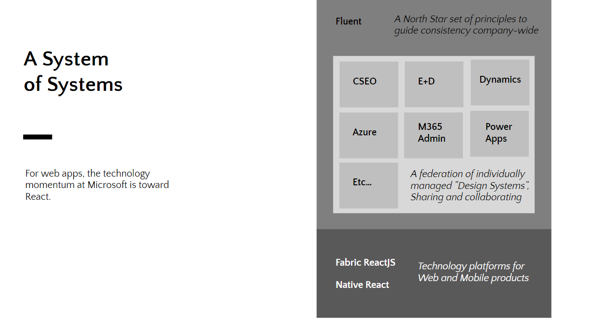
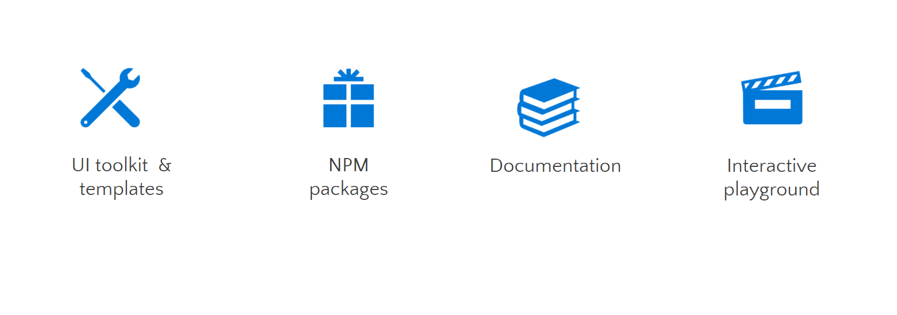
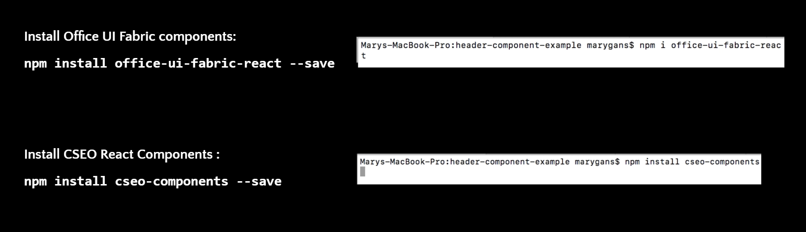
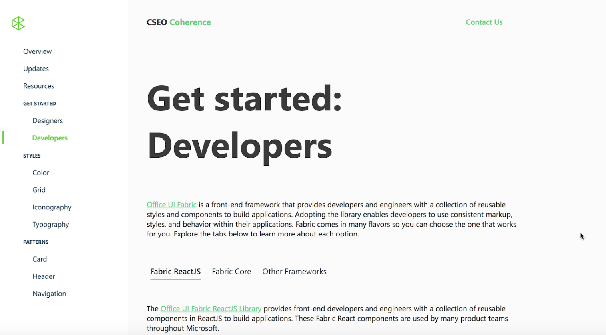
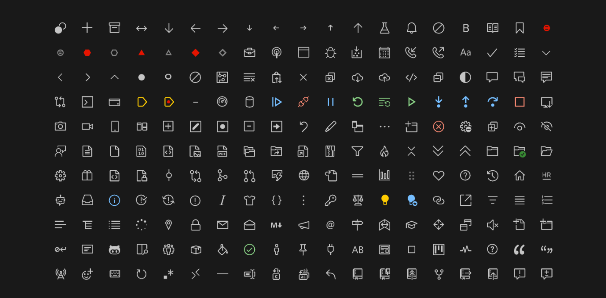
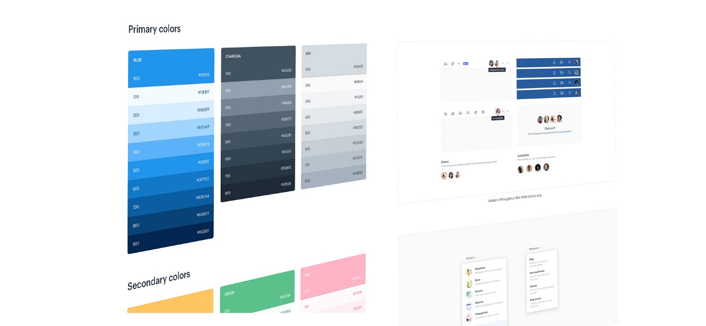

## Introduction

Core Services Engineering and Operations (CSEO) builds and manages the critical products and services that Microsoft runs on. As a core founding member of the CSEO design system, I wore many hats at on the Coherence team, but more than anything I’ve been the Engineering Lead for the digital transformation effort. 
I led a team of engineers creating interaction flows, user interviews, user testing, wireframing, prototyping, and implementation. I’ve also been responsible for evangelizing the importance of design thinking organization-wide and reinforcing the voice of the user as well as the internal field team and customer support engineers. 
I also worked closely with designers to establish the design system within Figma that can be consumed by designers. The deliverabled contributed to includes: color palettes, fonts, a full set of custom icons (328 and counting), a WIP set of custom components, and a centralized styleguide. 

<Row>
<Col>

</Col>
</Row>

## Why a Design System?
<Row>
<Col>

</Col>
</Row>

## Starting with the Basics
Building a design system to serve 1,500 products across businesses as diverse as HR, Finance, Sales, and Security is no small feat. Naturally, I started with a general audit of all the applications.
<Row>
<Col>

Text

</Col>
<Col>

Text

</Col>
</Row>

## What do Engineers get?
Developers get access to a UI toolkit in Figma and NPM packages for them to directly import reusable CSEO components. They also get access to documentation for best practices and how to best utilize the components and an interactive storybook playground to see the components live in action.

<Row>
<Col>

</Col>

</Row>

<Row>
<Col>

</Col>

</Row>

<Row>
<Col>

##### CSEO Website
I created a web application using Create React App to give Engineering Stakeholders can quickly access documentation and code snippets to directly import and include in their code.

</Col>

</Row>

## What do Designers get?
Designers get access to a UI toolkit in Figma and NPM packages for them to directly import reusable CSEO components. They also get access to documentation for best practices and how to best utilize the components and an interactive storybook playground to see the components live in action.

<Row>
<Col>

</Col>

</Row>

<Row>
<Col>

</Col>

</Row>
