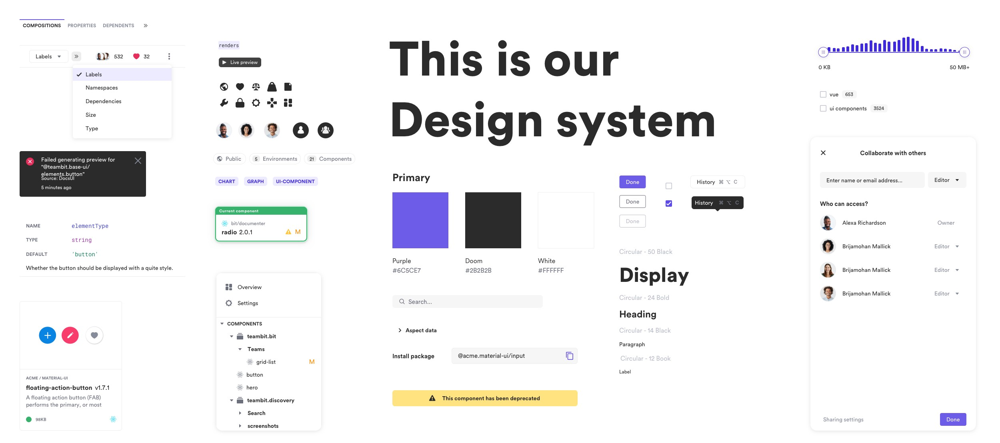

## Background

Core Services Engineering and Operations (CSEO) builds and manages the critical products and services that Microsoft runs on. As a core founding member of the CSEO design system, I wore many hats at on the Coherence team, but more than anything I’ve been the Engineering Lead for the digital transformation effort. 
I led a team of engineers creating interaction flows, user interviews, user testing, wireframing, prototyping, and implementation. I’ve also been responsible for evangelizing the importance of design thinking organization-wide and reinforcing the voice of the user as well as the internal field team and customer support engineers. 
I also worked closely with designers to establish the design system within Figma that can be consumed by designers. The deliverabled contributed to includes: color palettes, fonts, a full set of custom icons (328 and counting), a WIP set of custom components, and a centralized styleguide. 

<Row>
<Col>

</Col>
</Row>

<Row>
<Col>

Text

</Col>
<Col>

Text

</Col>
</Row>
