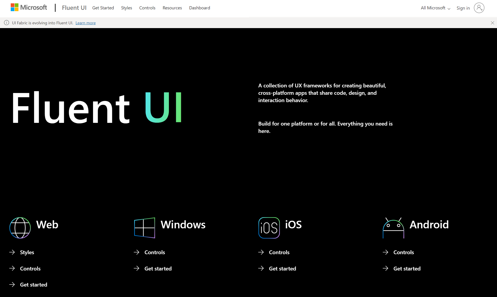
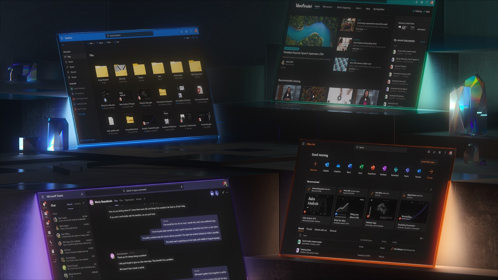
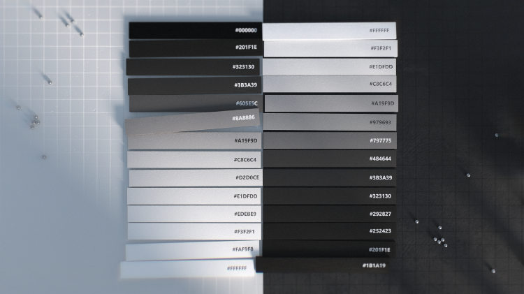
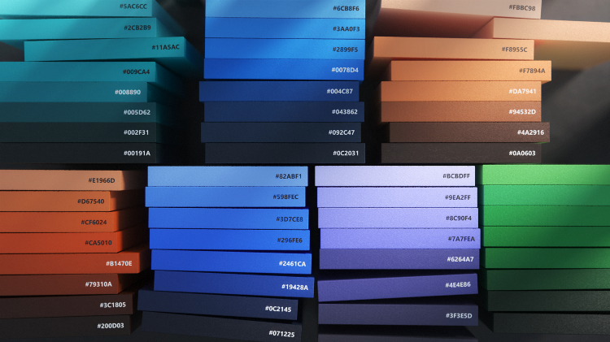
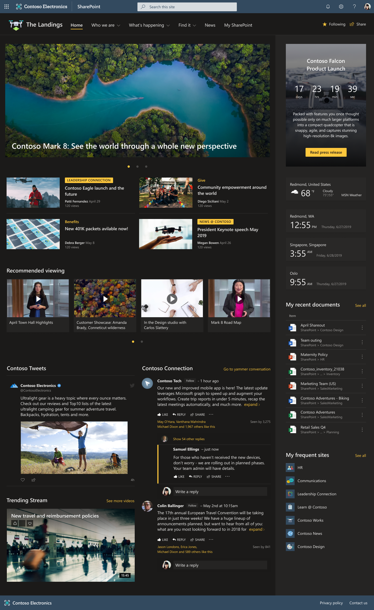
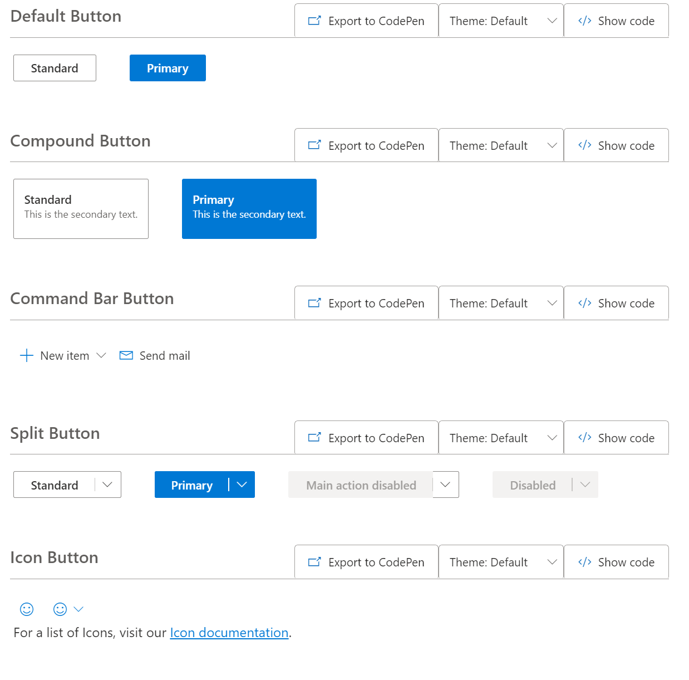
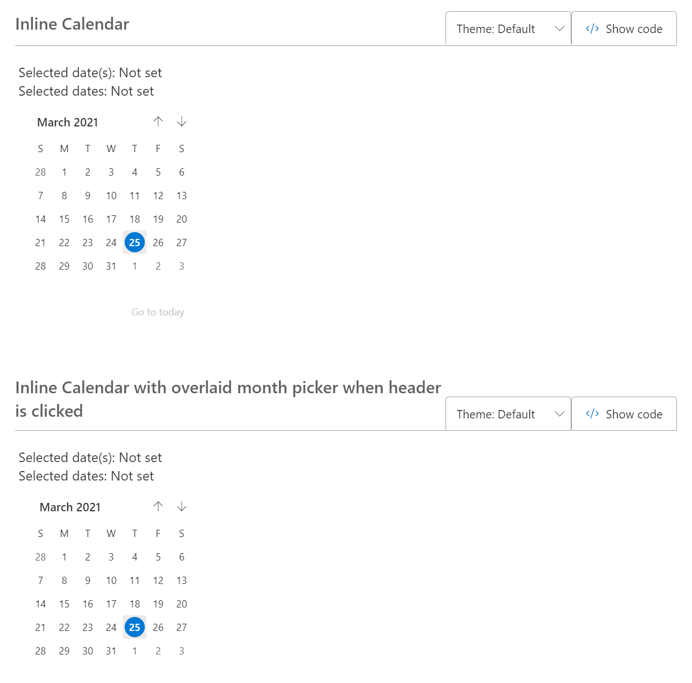

## Role

UI Design    | Development | Open Source repository management

## Tools

ReactJS   |   CSS-in-JS   |   Figma    

## Introduction
Fluent Design is a collection of UX frameworks for creating beautiful, cross-platform apps that share code, design, and interaction behavior. Fluent is the way Microsoft designs and builds digital product experiences internally, with external customers, and the open source community. 

During my time on the team, I specifically worked on Fluent Web components built in TypeScript ReactJS. I partnered closely with UX Designers, Product Managers, and Engineers to maintain and update the components in the open-source repository in order to reflect new design perspectives and fix design-related bugs.

### Dark Mode Web
I worked with one core UX designer to create a custom dark theme for all the fluent components being used in SharePoint. I also implemented the dark theme toggle on the Fluent Design System website so that the web component playground can be viewed in dark mode. 
<Row>
<Col>

</Col>
</Row>

<Row>
<Col>

</Col>
<Col>

</Col>
</Row>

##### SharePoint dark mode
<Row>
<Col>

</Col>
</Row>

### Web Component Contribution
I was a core contributor to the Fluent UI web component library. The components are used across Microsoft and externally to empower teams to build and share resuable, product-agnostic components that are coherent across platforms and web.. The goal is for applications both in and outside of Microsoft to be built faster, with consistent pixel-perfect precision according to Microsoft's design language, high performance goals, and accessibility targets.

Below are a few of the many ReactJS components I contributed to over the 2 years I worked as a core contributor. Visit <a title="FluentUI Github" href="https://github.com/microsoft/fluentui" target="_blank">Fluent Design github</a> and <a title="fluent ui website" href="https://developer.microsoft.com/en-us/fluentui#/" target="">Fluent Design website</a> to learn more about the open-source project.

<Row>
<Col>

</Col>
<Col>

</Col>

<Col>

</Col>
</Row>

  