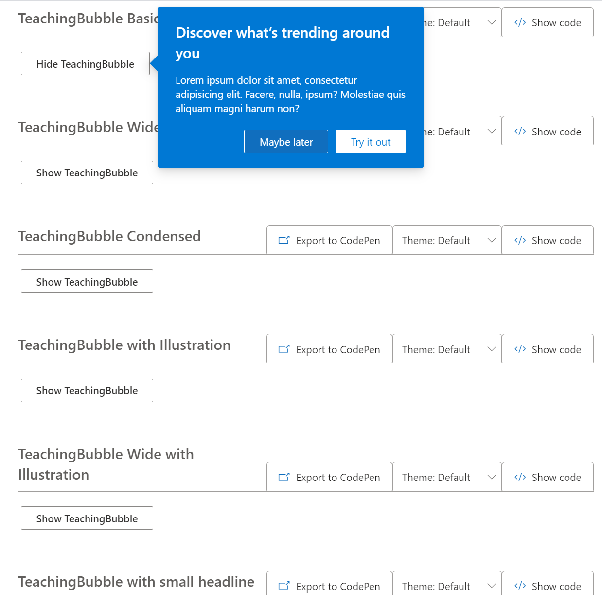

## Role

Design   |   Prototyping

## Tools

ReactJS   |   CSS   |   Figma    

## Introduction
Real Estate agents, property managers, and landlords have a difficult time scaling their business once it begins to grow and they have clientel. A big reason for this is, they are spending time showing properties to potential buyers and renters and less time scaling their businesses. 
Coraway soves this problem by providing these busy real estate professionals with a technology in which they can outsource their property showing to other real estate professionals that have extra time. 

### Dark Mode Web
I worked with one core designer and engineered a custom dark theme for all the fluent components being used in SharePoint. 
<Row>
<Col>

</Col>
</Row>

<Row>
<Col>

</Col>
<Col>

</Col>
</Row>

##### SharePoint dark mode
<Row>
<Col>

</Col>
</Row>

### Web Component Contribution
I was a core contributor to the Fluent UI component library. The components are used across Microsoft and externally to help teams build and share product components that are coherent across platforms and web. We leverage technologies like React, React Native, and Web Components to achieve these goals. The goal is for applications both in and outside of Microsoft to be built faster, with consistent pixel-perfect precision according to our design language, high performance goals, and accessibility targets.

Below are a few of many components I contributed to over the time I worked as a core contributor. Want to contribute or learn more about the open source project? Visit the <a title="FluentUI Github" href="https://github.com/microsoft/fluentui" target="_blank">FluentUI github site</a> and <a title="fluent ui website" href="https://developer.microsoft.com/en-us/fluentui#/" target="_blank">website</a>.

<Row>
<Col>

</Col>
<Col>

</Col>

<Col>

</Col>
</Row>

  