## Role

Lead UX Designer  

## Tools

 Figma   |  FigJam |  PowerPoint

## Introduction
Industry Cloud Solution platforms are designed to meet the specific needs of vertical industry segments inadequately served by generic solutions. Our team empowers companies across industries to improve time to value, reduce costs, increase agility, and accelerate innovation for sustainable growth.

< br />

My work on this team involves co-innovation and collaboration, combining traditional cloud services with tailored, industry-specific functionality to address historically hard-to-tackle vertical challenges, effectively accelerating time to value. The industry-specific solution integrates cloud services across the depth of our offerings: Microsoft Azure, Microsoft 365, Microsoft Dynamics 365, and Microsoft Power Platform.

< br />

So far, I've worked on solutions in the following Industry Cloud Platforms:
* Microsoft Cloud for Retail
* Microsoft Cloud for Financial Services
* Microsoft Cloud for Sustainability
* Microsoft Cloud for Manufacturing

 

## Microsoft Cloud for Retail
I leveraged Figma to customize the existing Teams app in order to empowers frontline workers and improve store operations, from the shop floor to the top floor. This customized Teams solution brought collaboration and operations together to help store teams stay organized and connected.
<Row>
<Col>
</Col>
</Row>

I fostered collaboration and consistency across product teams by working closely with product managers, designers, and engineers within the Teams product team and the cross-functional Industry Cloud Solutions team.
<Row>
<Col>

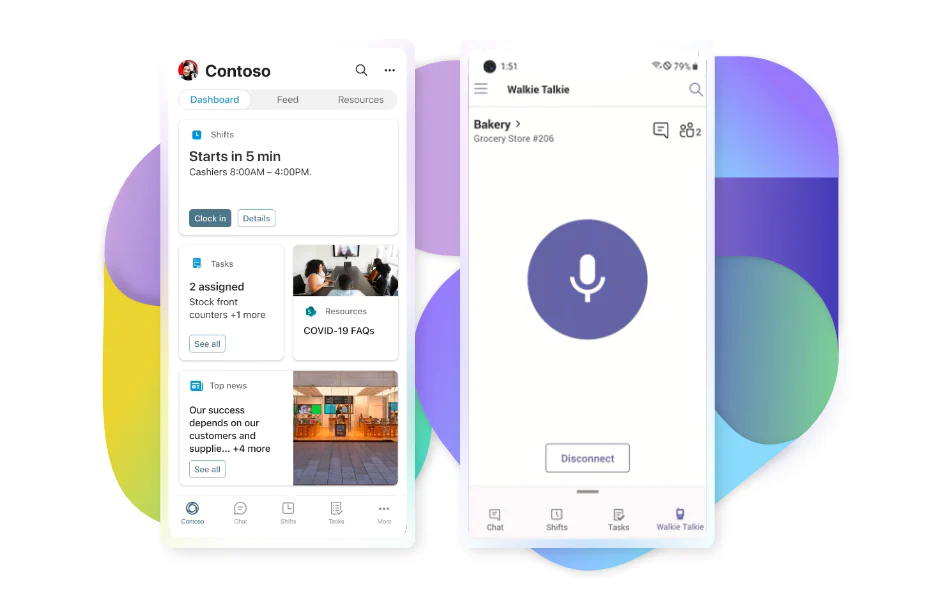

</Col>
<Col>

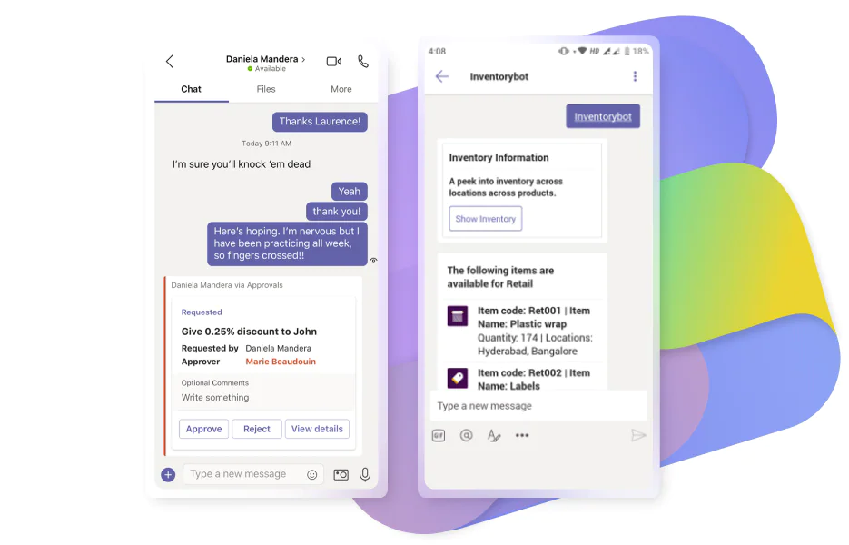

</Col>
</Row>

 

## Microsoft Cloud for Financial Services
I leveraged Figma to customize the existing Dynamics 365 (Unified Customer Profile) app in order to empower financial service providers to get a digestable, 360-degree view of their customers.
With the customized experience, lenders can securely connect all loan-related data and improve lending team collaboration to drive a better, faster mortgage experience for consumers.

<Row>
<Col>

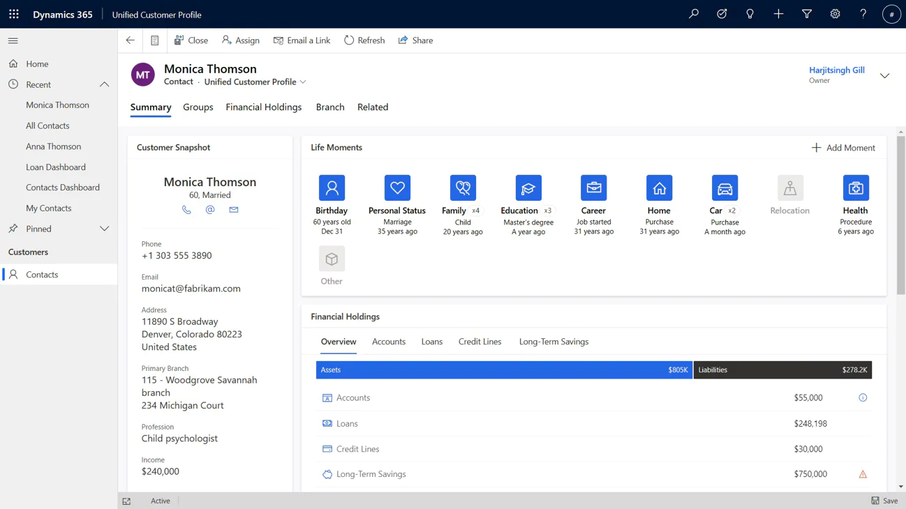

</Col>

</Row>

< br />

##### Customized features

I collaborated with stakeholders to understand the existing gaps in the current dashboard experience for financial service providers. For storytelling purposes, our dashboad customization was focused on 
giving mortgage lenders an all encompassing view of a existing bank customer looking to buy a home.

 
I created persona details surrounding the customer that would be representative of a common demographic and storyline our banking parters often encounter in the industry.  
To elevate this story we included loan application process wizard as well as widgets that highlighted important loan information related to the customer to quickly onboard the mortgage lender.
<Row>

<Col>

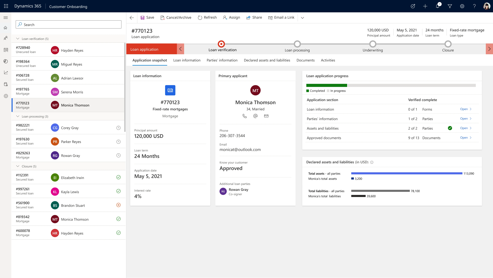

</Col>
<Col>

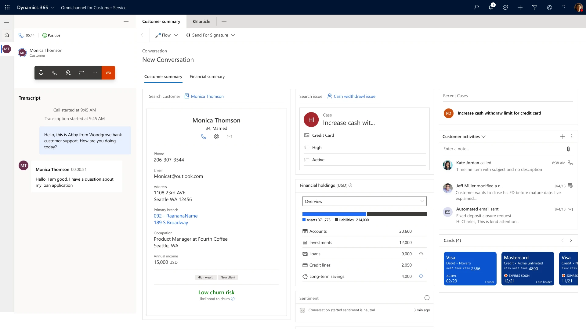

</Col>

</Row>

<Row>
<Col>

 

## Microsoft Cloud for Sustainability
I leveraged design and collaboration tools to empower customers to record their environmental footprint, report to stakeholders, and reduce resource usage — all toward taking industry-specific actions on a path to net zero.

< br />

<Row>
<Col>

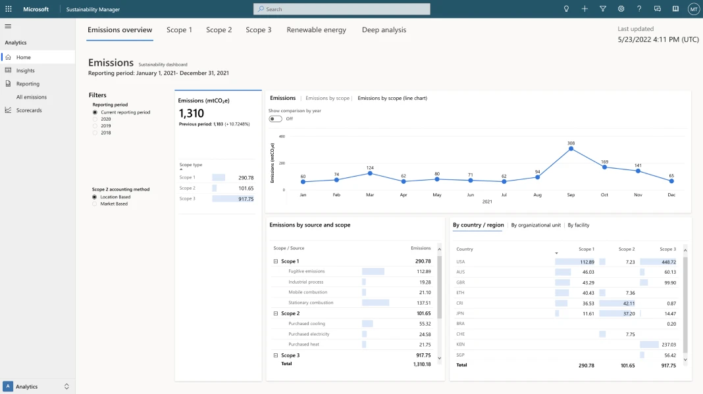

</Col>
</Row>

##### Customized features
Armed with emissions and revenue intensity data provided by Cloud for Sustainability, companies have further guidance on how they can drive efficiencies and carbon reductions, in an effort to move faster toward net-zero.

I collaborated with other designers and engineers to create a variety of dashboards (some shown below) equipped with the recommended calculations specific to emissions source and activity, and with industry-standard coefficients.
Our solution included precalculated data across Scopes 1, 2, and 3. 

</Col>

</Row>

<Row>
<Col>

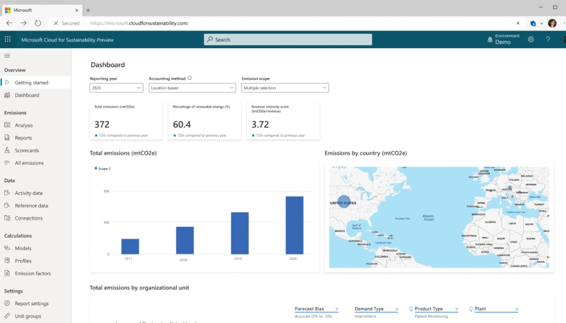

</Col>

<Col>

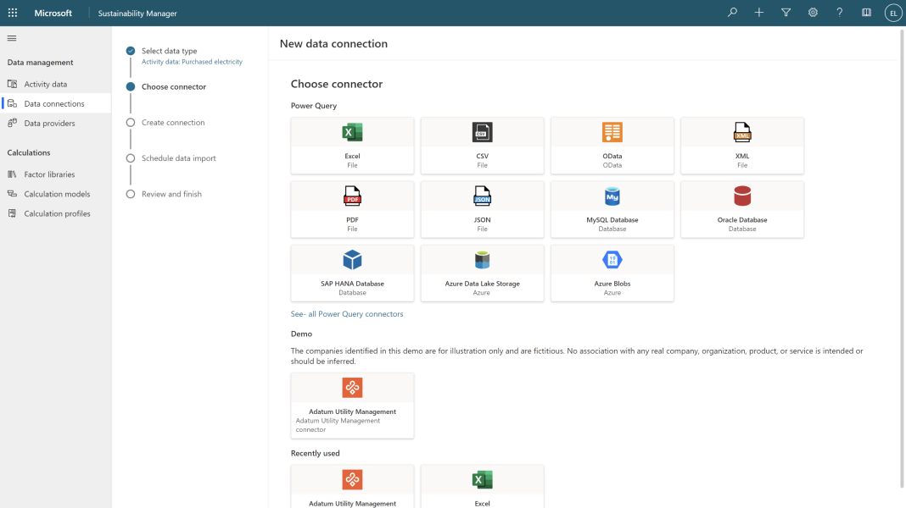

</Col>

</Row>

I also collaborated closely with stakeholders and industry experts to inform the design and development of built-in preparatory reports to streamline public reporting for reporting to government agencies.

<Row>
<Col>

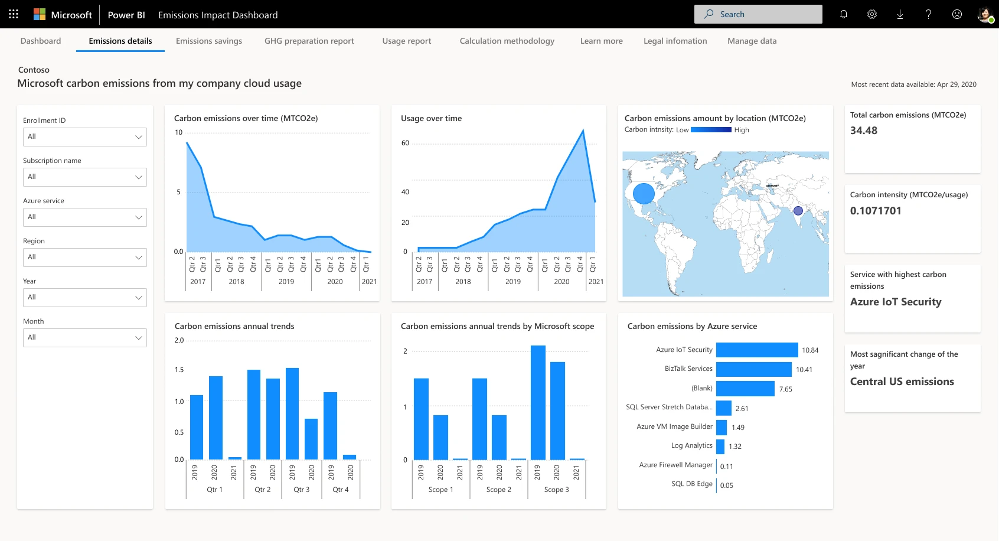

</Col>

<Col>

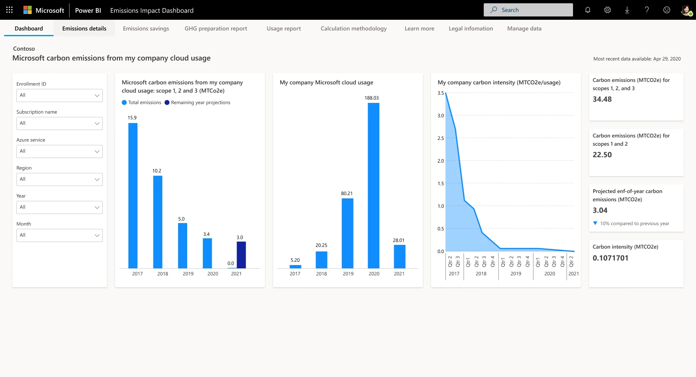

</Col>

</Row>
<Row>

</Row>

< br />

## Microsoft Cloud for Manufacturing
The Microsoft Cloud for Manufacturing is designed to give manufacturers the flexibility to adopt the capabilities such as building more agile factories, creating more resilient supply chains, empowering the hybrid workforce to engage customers in new ways, or unlocking innovation and delivering new services.

<Row>
<Col>

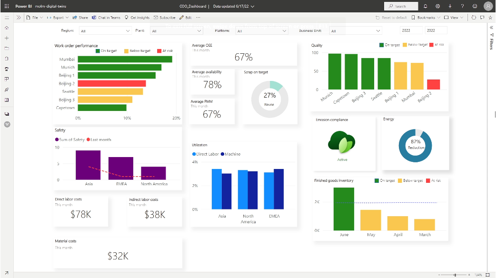

</Col>

</Row>
In collaboration with stakeholders, we created a pre-built modular digital supply chain twin to help demonstrate a common use case in which a physical supply chain is used to predict disruptions and proactively overcome them. In the event of a global disruption, manufacturers can analyze both upstream and downstream impact and perform simulations and model scenarios at scale to determine the best resolution and then automate that response. 

<Row>
<Col>

</Col>
<Col>

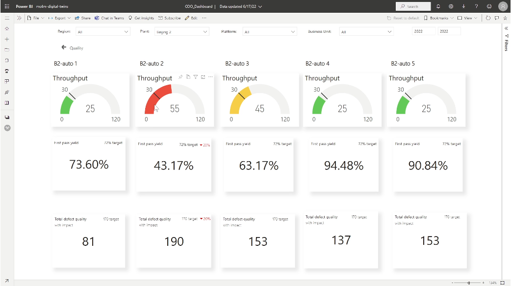

</Col>

</Row>
