## Role

Prototyping    |    Product Development    |    Design   

## Tools

ReactJS   |   SASS/CSS   |   Figma    |    A/B testing   |   Usability testing

## Team Composition

2 UX Engineers    |    2 Designers    |   2 Engineers   | 2 Program Mangagers   

## Introduction
Microsoft Lists is a Microsoft 365 app that helps you track information and organize work. It's simple, smart, and flexible, so you can stay on top of what matters most to your team. Track issues, assets, routines, contacts, inventory and more using customizable views and smart rules and alerts to keep everyone in sync. With ready-made templates, you can quickly start lists online, on the mobile app, or with Microsoft Teams.

Our team created a prototype to experiment with new features that were to be added into the product experience. We conducted usability and A/B tests as needed. We conducted three different tests prior to the release of Microsoft Lists. It was essential to ensure the validated features from the prototype was also added to the product experience code bases as well. 

<Row>
<Col>

</Col>
</Row>

## Toolkit for Guidance
Iteration is the name of the game for the initial work on Microsoft Lists. The design kits in Figma served as the living source of truth for the product as was vital for getting the protypes ready for usability studies. When prototyping, I always made sure I had the relevant design toolkit files open and updated and the designer not to far away for quick brainstorming or collaboration sessions. 
<Row>
<Col>

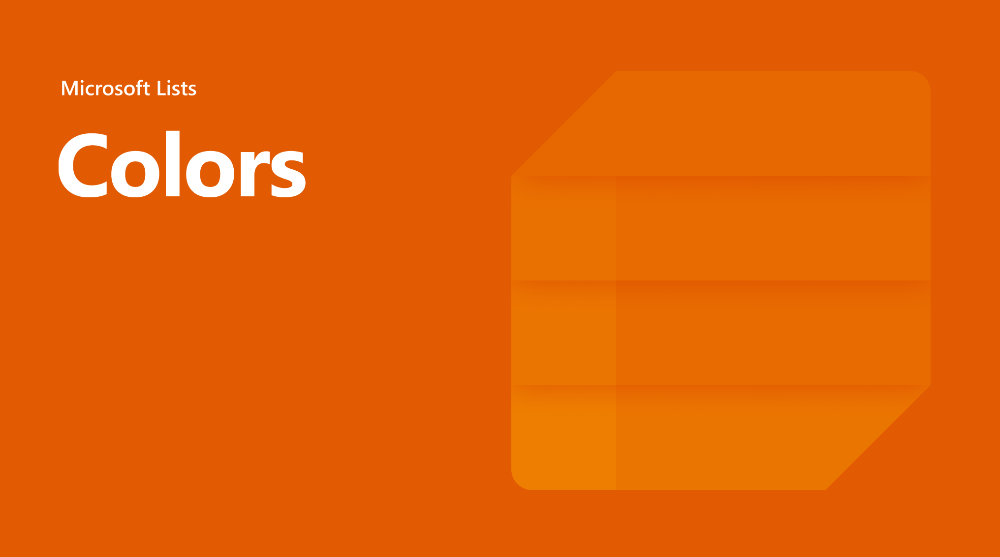

</Col>
<Col>

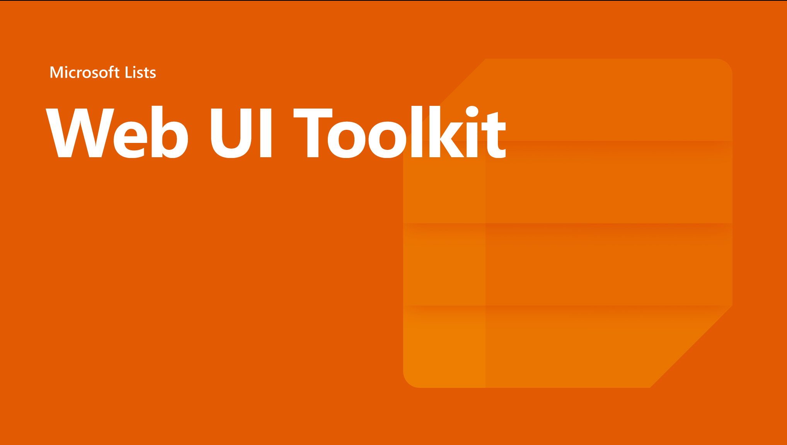

</Col>
</Row>

## Prototype
Myself and 2 other UX Engineers developed an interactive prototype. We worked with designers, product managers, and UX Researchers to help with the overall vision, planning, user testing and design direction. I fully owned the Lists app home page, list creation, filtering, favoriting and templates journey.

##### Lists Home 
<Row>
<Col>

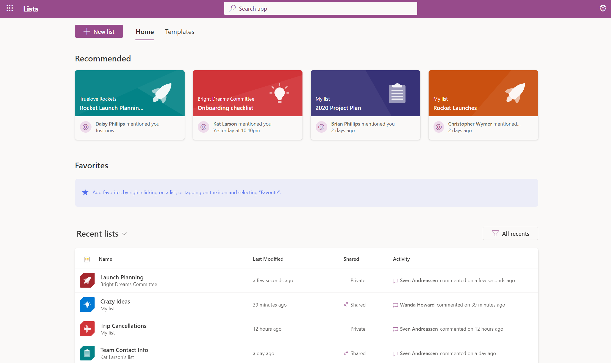

</Col>
<Col>

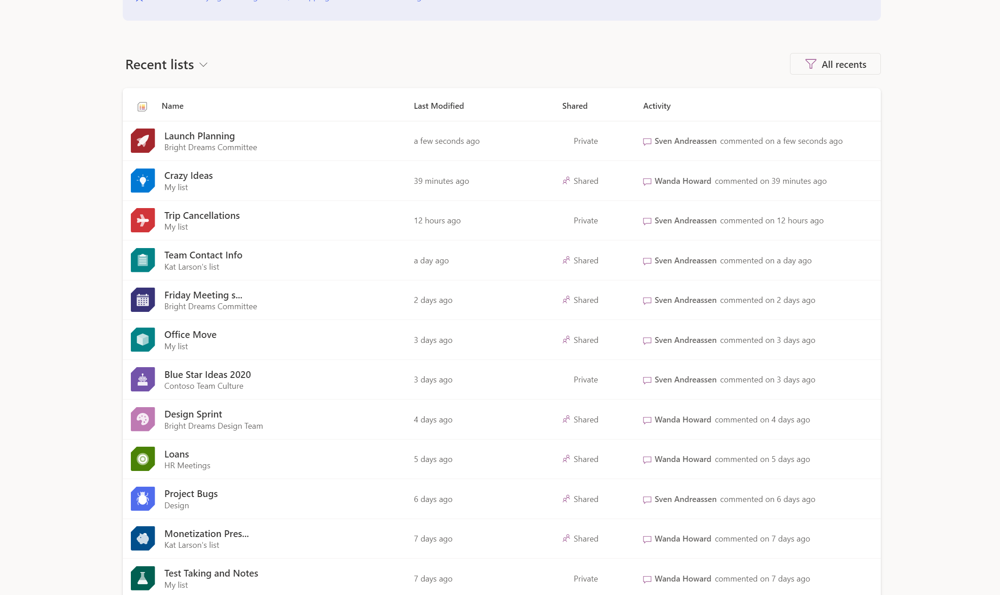

</Col>
</Row>

##### List Creation
<Row>
<Col>

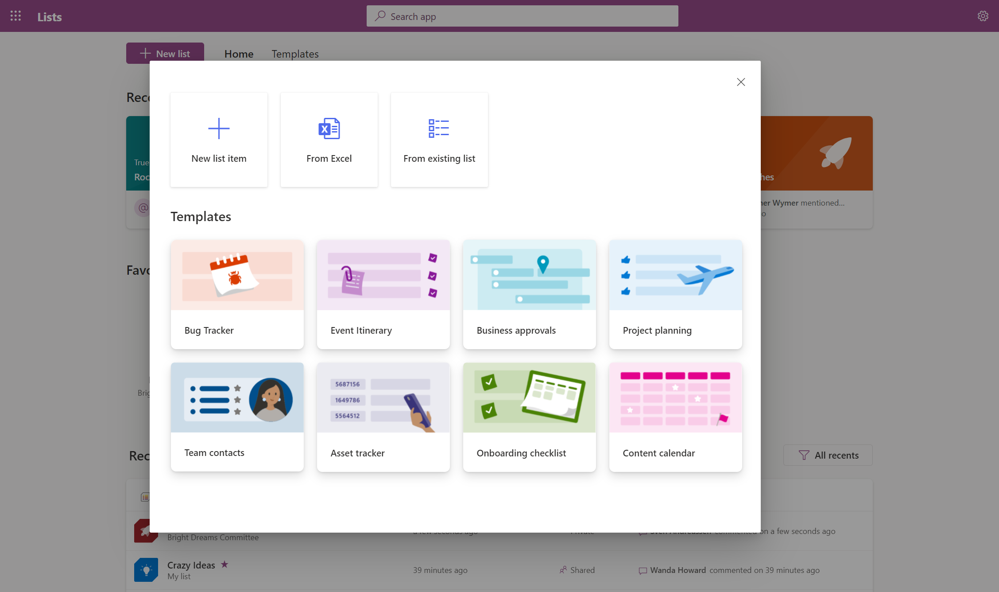

</Col>
</Row>

<Row>
<Col>

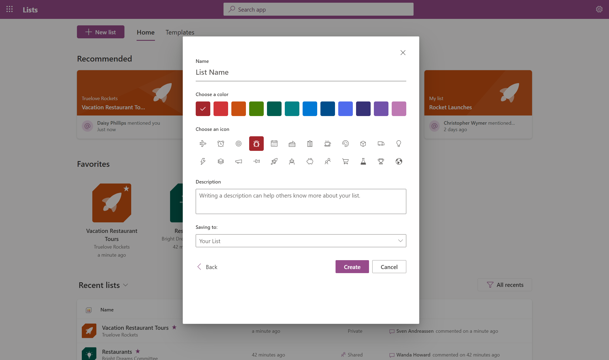

</Col>
<Col>

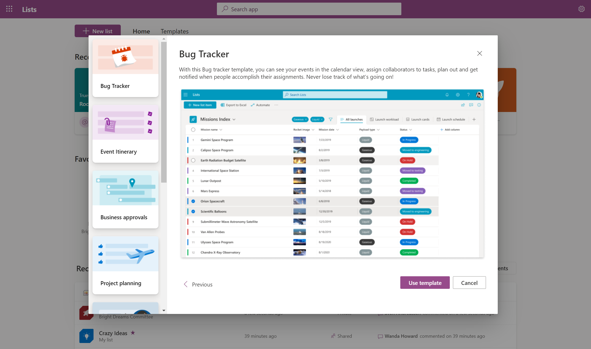

</Col>
</Row>

##### Template Gallery
<Row>
<Col>

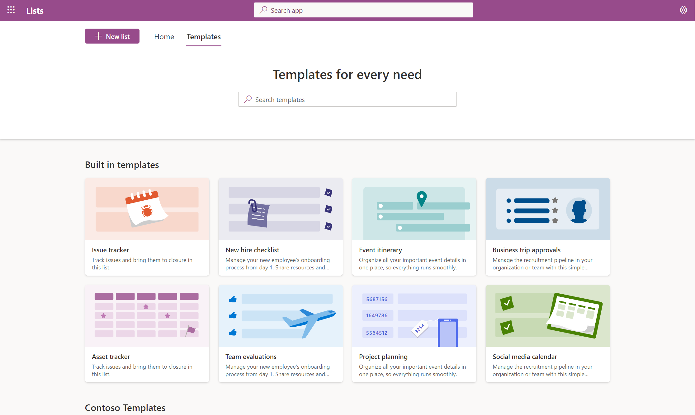

</Col>
</Row>

<Row>
<Col>

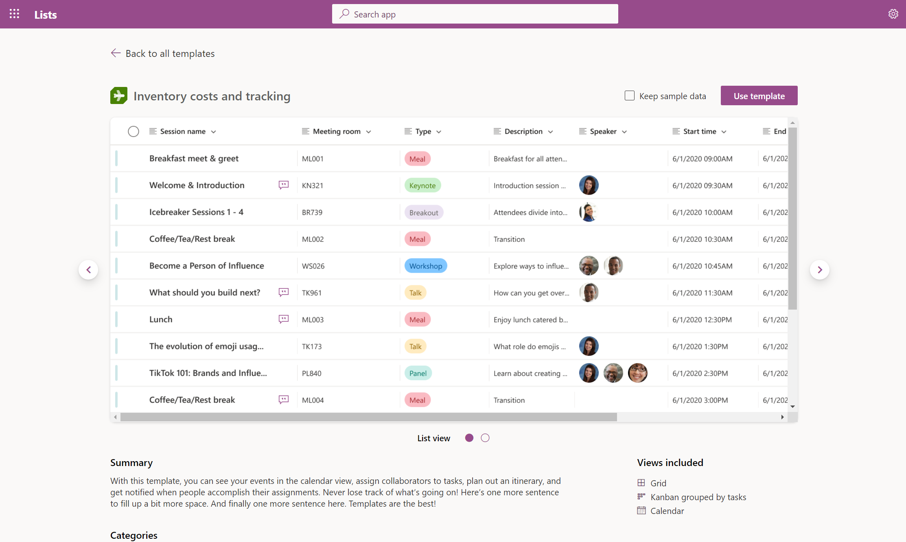

</Col>
<Col>

</Col>
</Row>

##### Filtering 
<Row>
<Col>

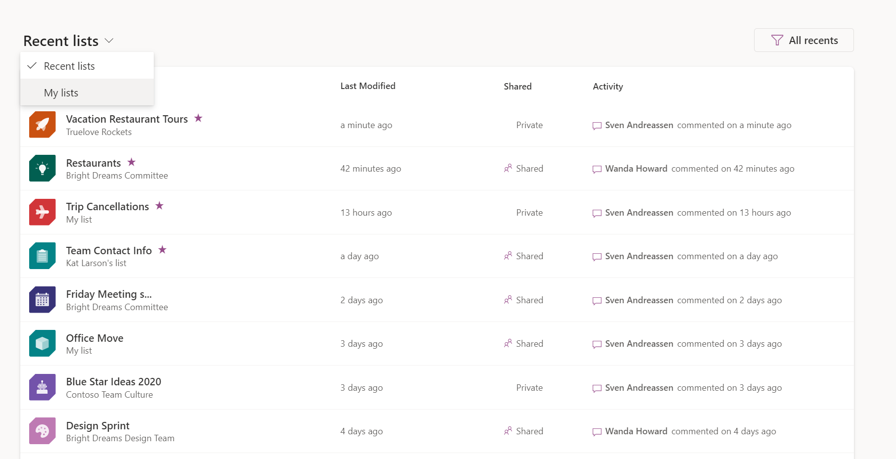

</Col>
<Col>

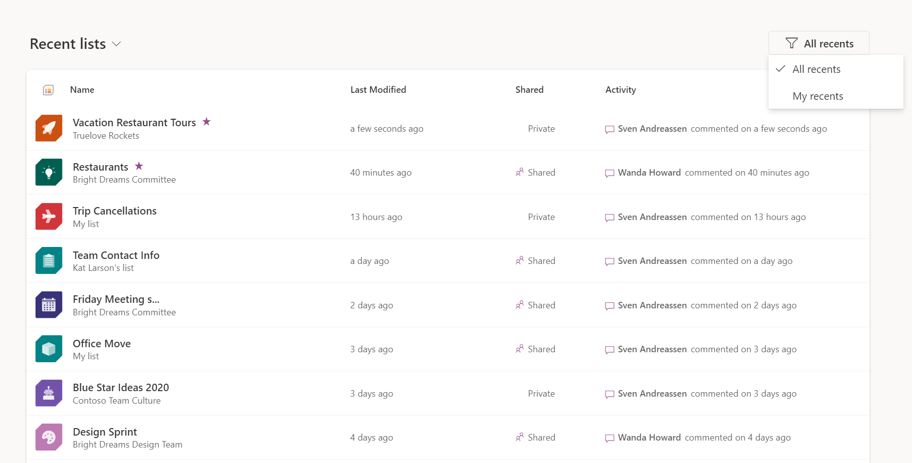

</Col>
</Row>

##### Favoriting
<Row>
<Col>

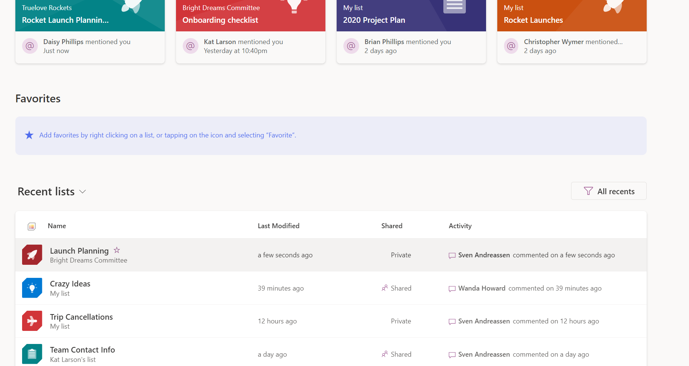

</Col>
<Col>

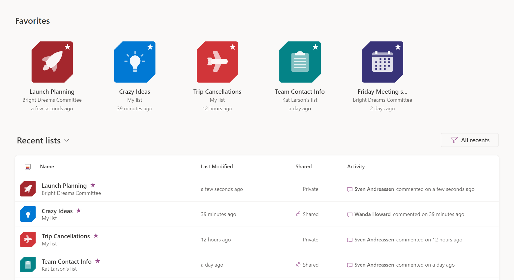

</Col>
</Row>

### Lists View

<Row>
<Col>

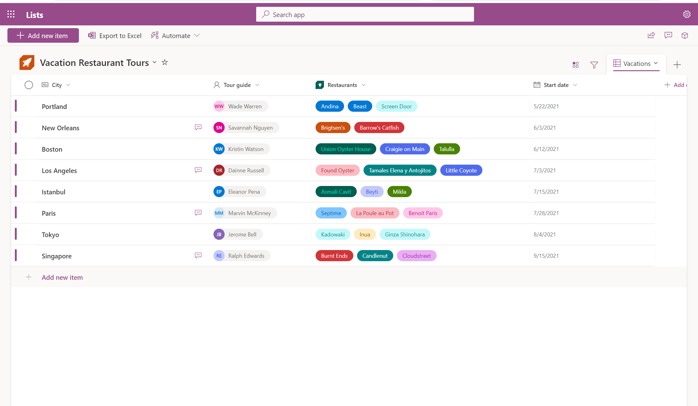

</Col>
</Row>

##### Commenting and Sharing
<Row>
<Col>

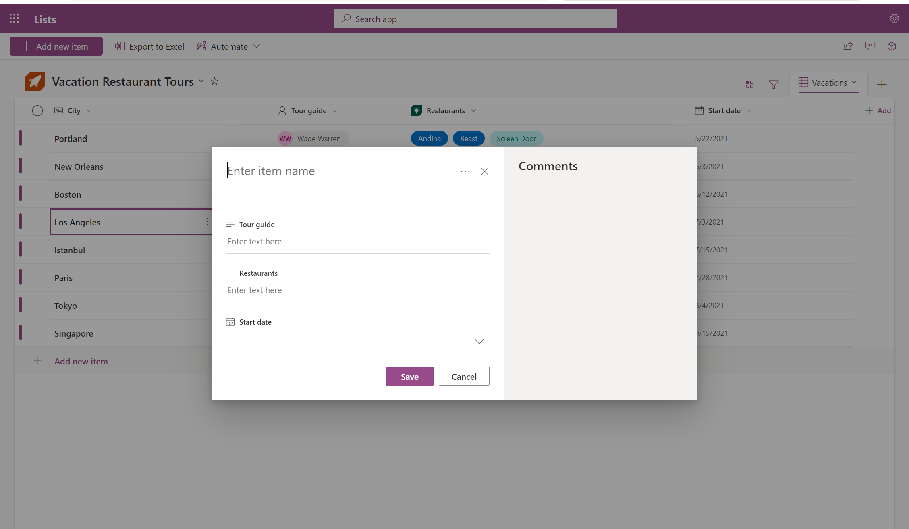

</Col>
<Col>

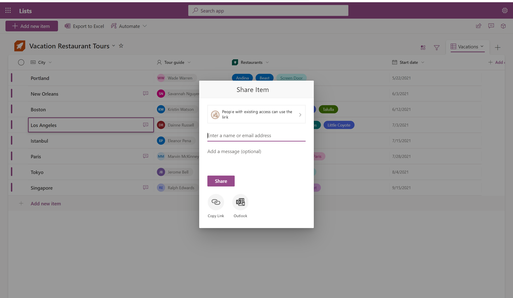

</Col>
</Row>

##### Templates
<Row>
<Col>

</Col>
<Col>

</Col>
</Row>