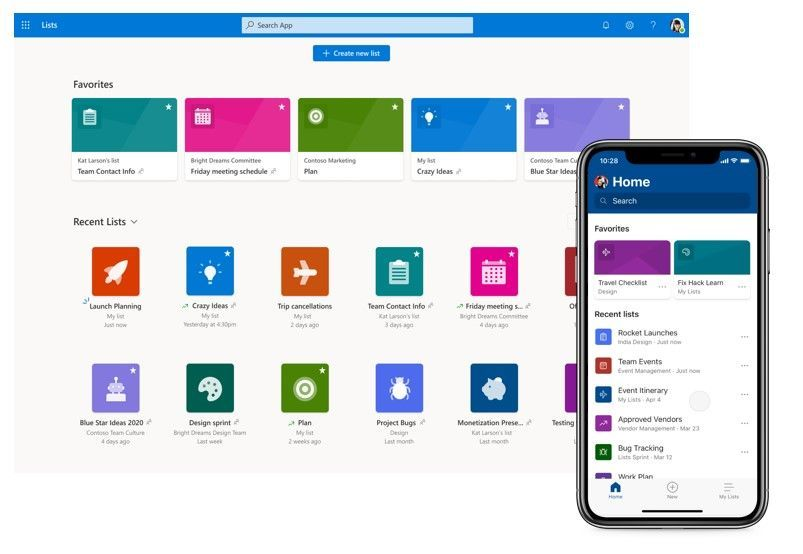

## Introduction
Microsoft Lists is a Microsoft 365 app that helps you track information and organize work. It's simple, smart, and flexible, so you can stay on top of what matters most to your team. Track issues, assets, routines, contacts, inventory and more using customizable views and smart rules and alerts to keep everyone in sync. With ready-made templates, you can quickly start lists online, on our new mobile app, or with Microsoft Teams.

<Row>
<Col>

</Col>
</Row>

## Toolkit for Guidance

<Row>
<Col>

Text

</Col>
<Col>

Text

</Col>
</Row>

## Prototype
Myself and 2 other UX Engineers developed an interactive prototype. We workied with several designers, program managers, and UX Researchers to help with the overall vision, planning, user testing and direction.

##### Lists Home 
<Row>
<Col>

Text

</Col>
<Col>

Text

</Col>
</Row>

##### List Creation
<Row>
<Col>

Text

</Col>
<Col>

Text

</Col>
</Row>

##### Filtering 
<Row>
<Col>

Text

</Col>
<Col>

Text

</Col>
</Row>

##### Favoriting
<Row>
<Col>

Text

</Col>
<Col>

Text

</Col>
</Row>

### Lists View

<Row>
<Col>

</Col>
</Row>

##### Commenting and Sharing
<Row>
<Col>

Text

</Col>
<Col>

Text

</Col>
</Row>