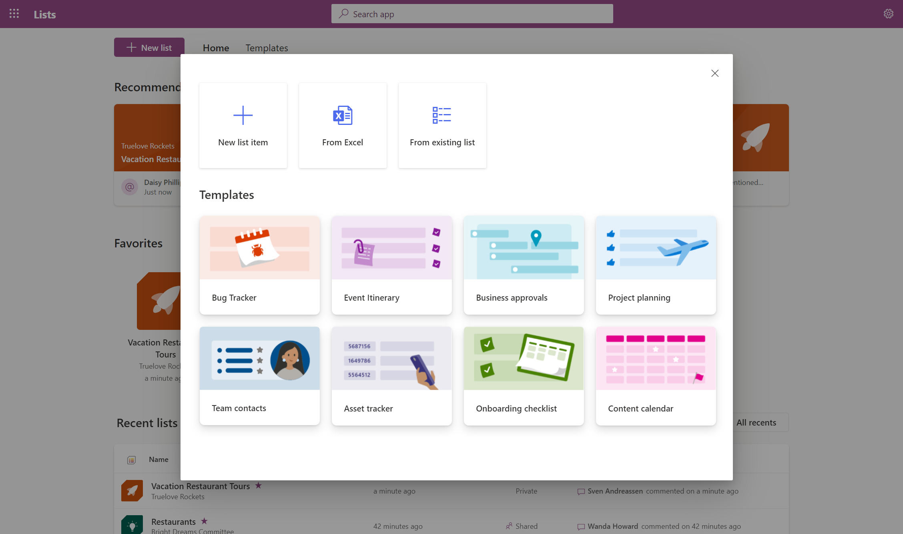
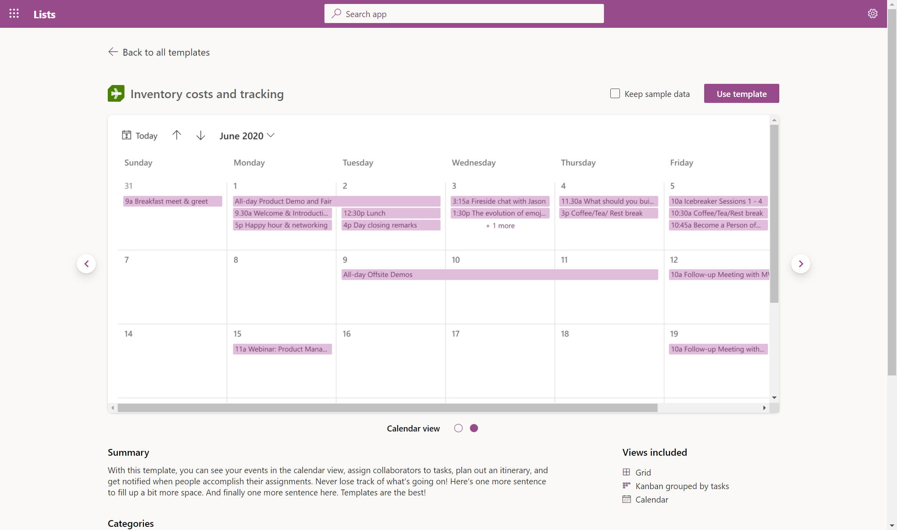

## Role

Prototyping    |    Product Development    |    DDesign   

## Tools

ReactJS   |   SASS/CSS   |   Figma    |    Animate.css

## Introduction
Microsoft Lists is a Microsoft 365 app that helps you track information and organize work. It's simple, smart, and flexible, so you can stay on top of what matters most to your team. Track issues, assets, routines, contacts, inventory and more using customizable views and smart rules and alerts to keep everyone in sync. With ready-made templates, you can quickly start lists online, on the mobile app, or with Microsoft Teams.

<Row>
<Col>

</Col>
</Row>

## Toolkit for Guidance
Iteration is the name of the game for the initial work on Micorosoft Lists. The design kits in Figma served as the living source of truth for the product as was vital for getting the protypes ready for usability studies. When prototyping, I always made sure I had the relevant design toolkit files open and updated and the designer not to far away for quick brainstorming or collaboration sessions. 
<Row>
<Col>

</Col>
<Col>

</Col>
</Row>

## Prototype
Myself and 2 other UX Engineers developed an interactive prototype. We workied with several designers, program managers, and UX Researchers to help with the overall vision, planning, user testing and design direction. I fuly owned Lists Home, list creation, filtering, favoriting and templates journey. My colleagues owned the Lists View journey.

##### Lists Home 
<Row>
<Col>

</Col>
<Col>

</Col>
</Row>

##### List Creation
<Row>
<Col>

</Col>
</Row>

<Row>
<Col>

</Col>
<Col>

</Col>
</Row>

##### Template Gallery
<Row>
<Col>

</Col>
</Row>

<Row>
<Col>

</Col>
<Col>

</Col>
</Row>

##### Filtering 
<Row>
<Col>

</Col>
<Col>

</Col>
</Row>

##### Favoriting
<Row>
<Col>

</Col>
<Col>

</Col>
</Row>

### Lists View

<Row>
<Col>

</Col>
</Row>

##### Commenting and Sharing
<Row>
<Col>

</Col>
<Col>

</Col>
</Row>

##### Templates
<Row>
<Col>

</Col>
<Col>

</Col>
</Row>