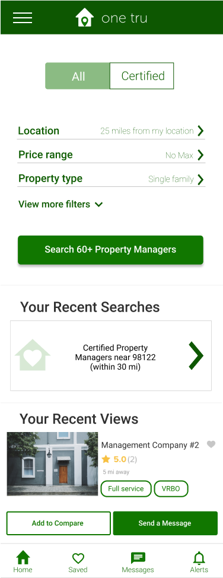
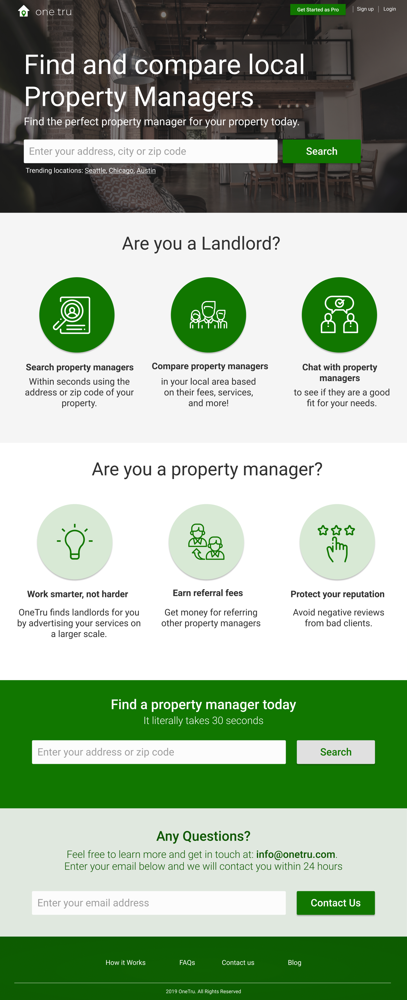

## Role

UX Designer   |   Product Development   |   Prototyping

## Tools

ReactJS   |   Figma   |   CSS/HTML   |    Firebase

## Introduction

This prototype was a passion project concieved from my personal pain points as a landlord. I began prototyping alternative ways to find and hire a property management company. I experienced the pain point firsthand when I first started renting my property on Airbnb in 2017. I had an unreliable property manager through a referral and was looking to make a switch. After hours of reading through reviews on the internet and phone calls(answered and unanswered) I finally found a property manager I could trust. 

I couldn't help but ask the following questions: Is there a way I could've streamlined my search experience? Could I have automated this entire process or at least parts of the process? What if I could compare property managers or other real estate professionals online, the same way I would a car or house? I took pen to paper and started documenting my pain points and user journey. 

## Responsive Web Application

Onetru app is responsive and can be accessed via mobile device. Compare local property management companies based on reviews or their specialty. Users can filter based on the type of services you need. If you're interested, immediately send the manager a few questions about their business and availability. 
<Row>
<Col>

</Col>
<Col>

</Col>
</Row>

#### Web - Landing Page

Users can use the web application to explore property management companies and services. Compare local property management companies based on reviews or their specialty. Property management companies can sign up to generate leads from the web app.

<Row>

<Col>

</Col>
</Row>

#### Search Results Page

Users can search and filter results.

<Row>
<Col>

</Col>
</Row>

#### Property Management - profile page
Property management companies each have their own profile page where they can display images of their current portfolio of properties they are managing. A landlord can compare multiple property management companies at once.
<Row>
<Col>

</Col>
<Col>

</Col>
</Row>