## Role

Co-founder   |   Product Design    |   Customer Interviews   |   Web Development   |   Prototyping   |   Business Development

## Tools

ReactJS & CSS   |   Figma   |   Canva   |   |   Monday.com   |   Illustrator  

## Introduction
The Terrachain team was a lean team of 4 people (including myself) looking to make a dent on the commercial real estate industry. We were all passionate about proptech, experienced pain points in the industry, and moonlighting this project during some evenings after work. 

Commercial real estate constitutes a significant portion of world economic asset and transaction activity. Unfortunately, the commercial real estate industry consists of many siloed and independent networks with transactional friction and opacity between existing systems. Terrachain is a commercial real estate property management platform seeking to increase transactional transparency and create trust between real estate portfolio managers and building tenants.
<Row>
<Col>

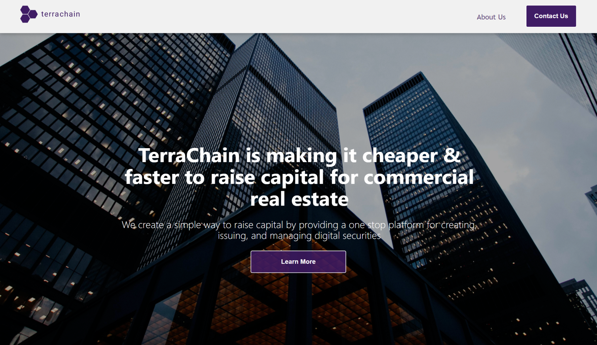

</Col>
</Row>

#### Logo Exploration
I conducted research on the industry and competitors before embarking on the project. This was important to understanding what can work and what's appropriate in the industry.  The team and I then went on a brainstorming and design thinking exploration - fun stuff. Creating a mind map helped us stay focused, make impactful decisions, and introduced several design directions. We wanted to separate ourselves from our competitors but still maintain simplicity and create a memorable brand. 
<Row>
<Col>

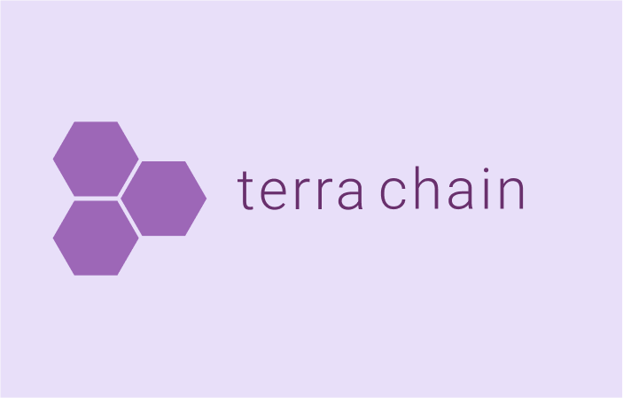

</Col>

<Col>

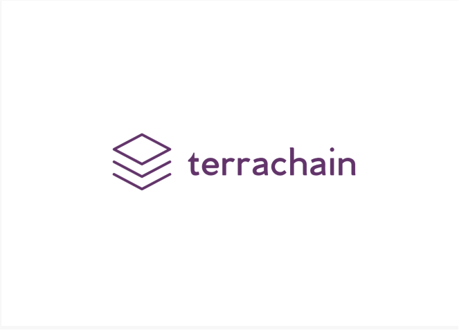

</Col>

<Col>

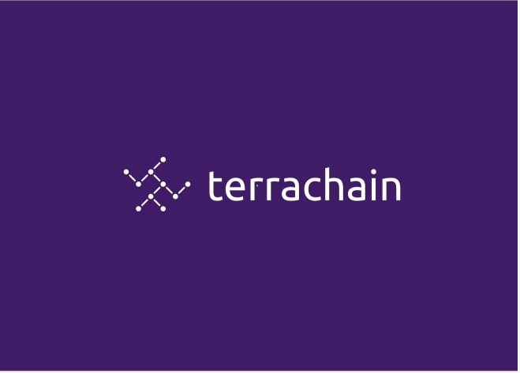

</Col>
</Row>

<Row>
<Col>

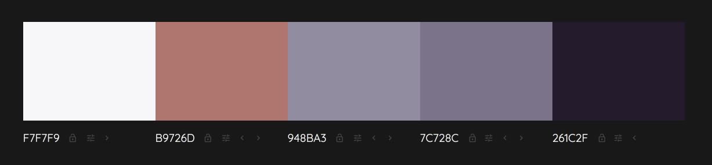

</Col>
</Row>

#### Client Portfolio Overview
Terrachain was focused more on small and medium portfolio's(10 million or less) as a starting point to build an initial proof of concept and achieve product-market fit. The vision is to be the trusted one-stop-shop for small, medium, and large real estate portfolio managers and companies.

<Row>
<Col>

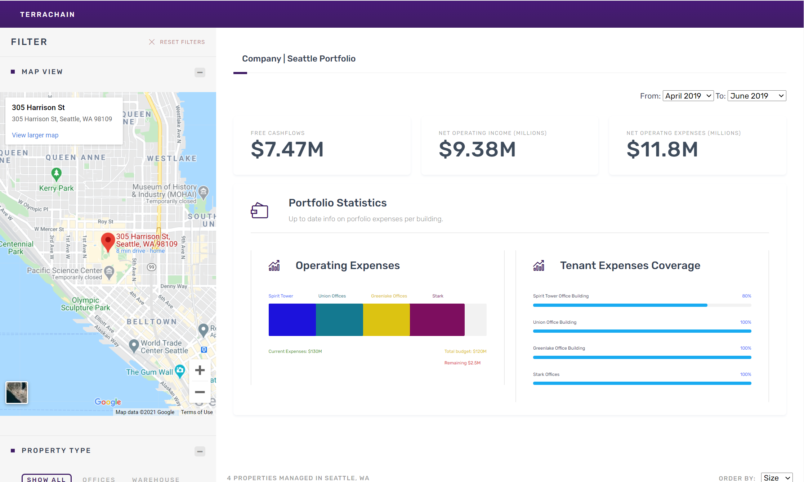

</Col>
</Row>

#### Operational Transparency
From a technology perspective, Terrachain is utilizing the blockchain on the backend to expidite and increase transparency. 

The Ethereum blockchain presents a practical solution to realize the following industry benefits:

- Real-time insights into data to increase transparency and inform better investment decisions and portfolio management
- Tokenization of real estate assets
- Process efficiency for underlying industry operations
- Access to broader investor pools due to ownership fractionalization
- Access to secondary market opportunities

<Row>
<Col>

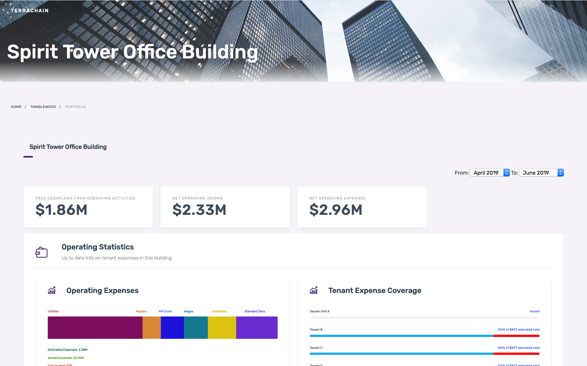

</Col>
</Row>

###### Property Insights
Based on continuous iterations inspired by customer feedback, I created a portal to give portfolio managers access to real-time occupancy data and statistics for each of their building tenants.
<Row>
<Col>

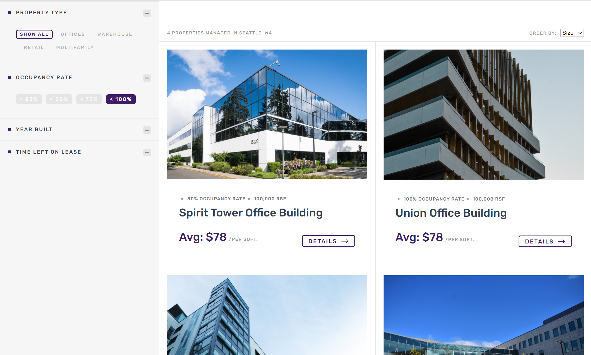

</Col>
<Col>

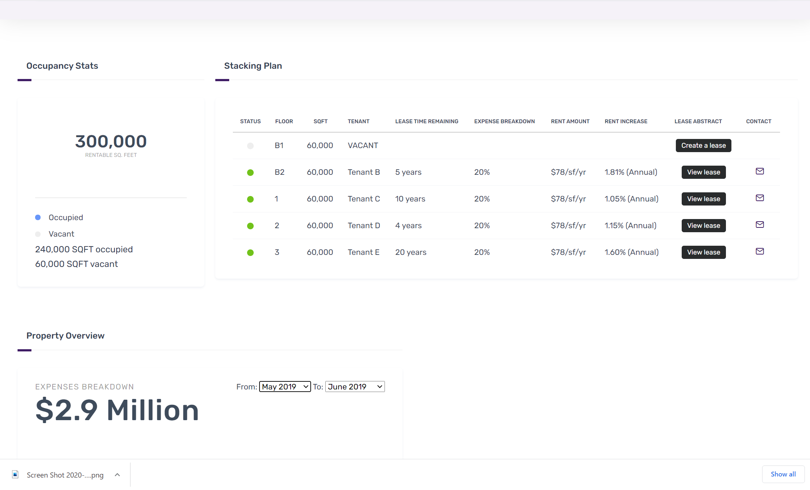

</Col>
</Row>

###### Lease Creation
Portfolio managers can create an interactive lease in the portal. If they had existing leases on other platforms or paper leases, they could upload them into our software. 
<Row>
<Col>

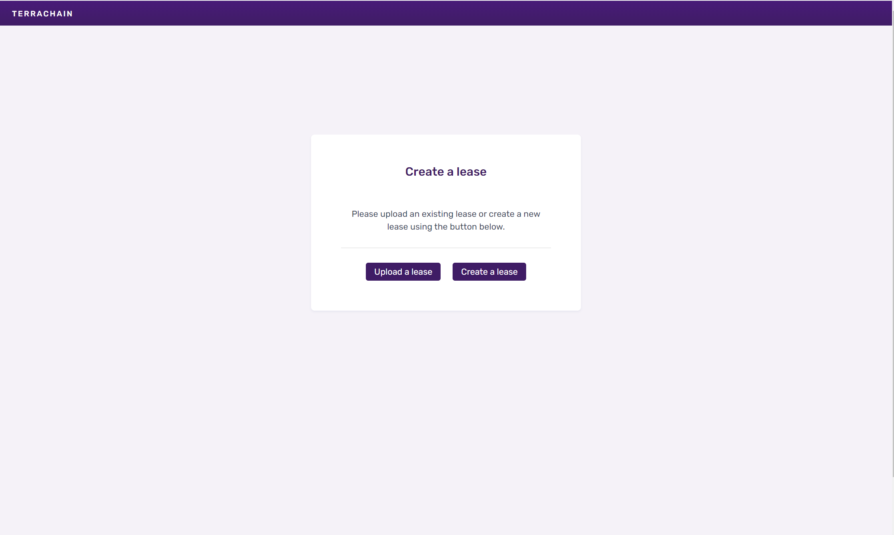

</Col>
<Col>

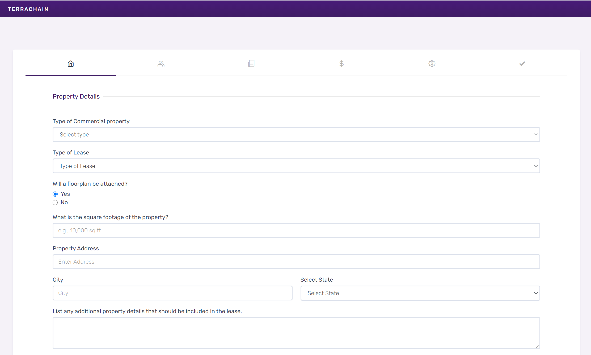

</Col>
</Row>

###### Real-time Lease Insights
Operating expenses customarily include repairs to the building including core building systems such the HVAC, elevators, and sprinkler system. Often tenants just receive a bill periodically. Terrachain's interactive lease benefits both tenants and portfolio managers by providing them with real-time insights to expenses as they come up.
<Row>
<Col>

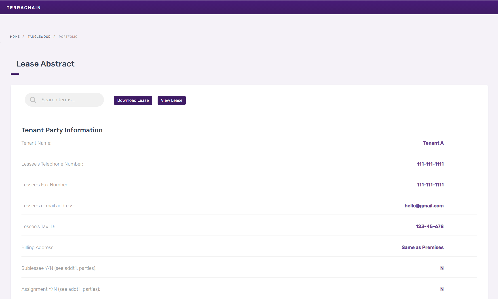

</Col>
<Col>

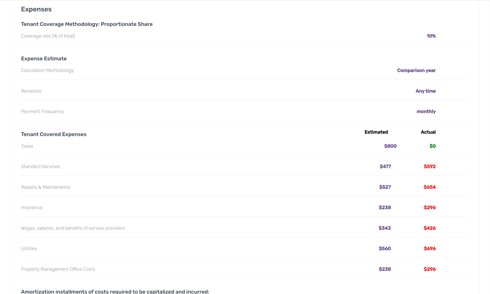

</Col>
</Row>

##### Cap table and Financial Reporting
Lofty goal was also to provide cap-table and financial reporting automation, distributions, and investor communications capabilities on the platform.
<Row>
<Col>

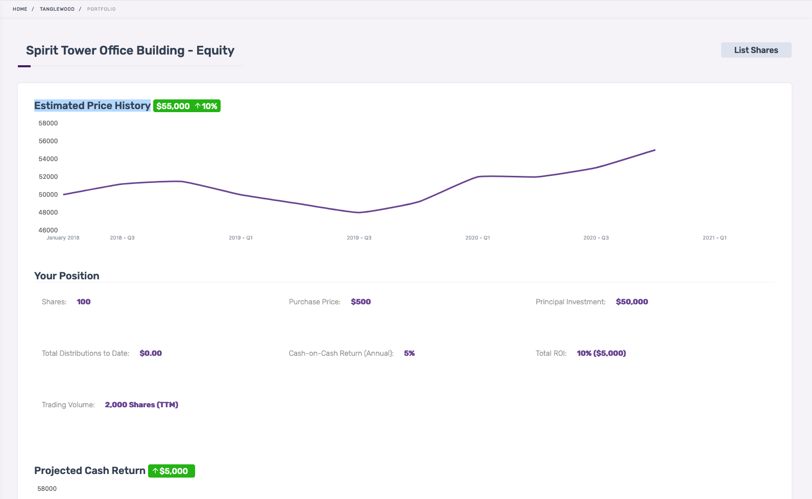

</Col>

<Col>

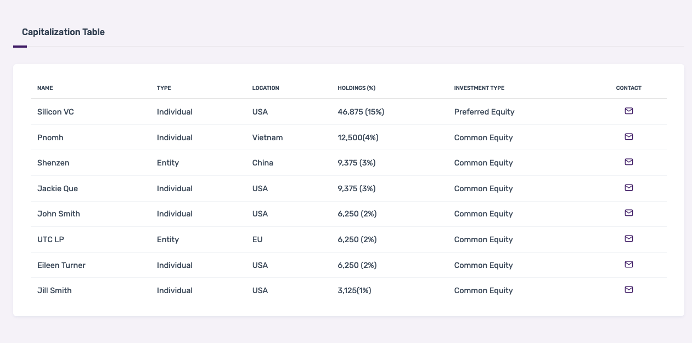

</Col>
</Row>